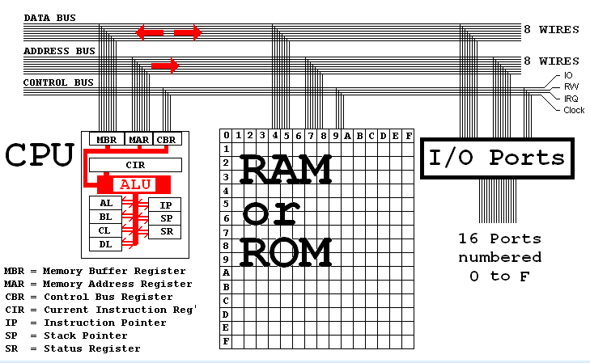
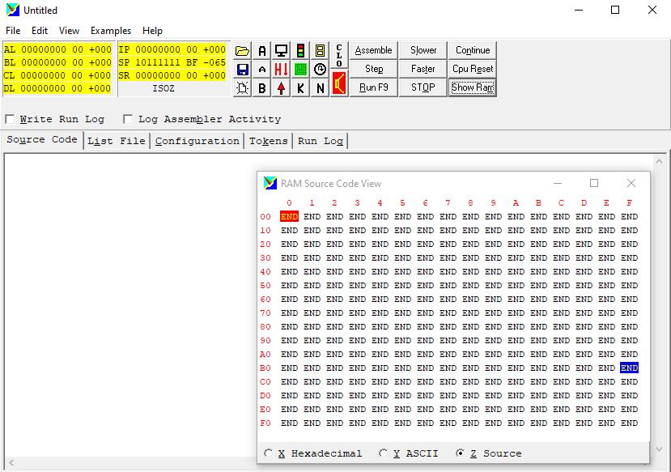
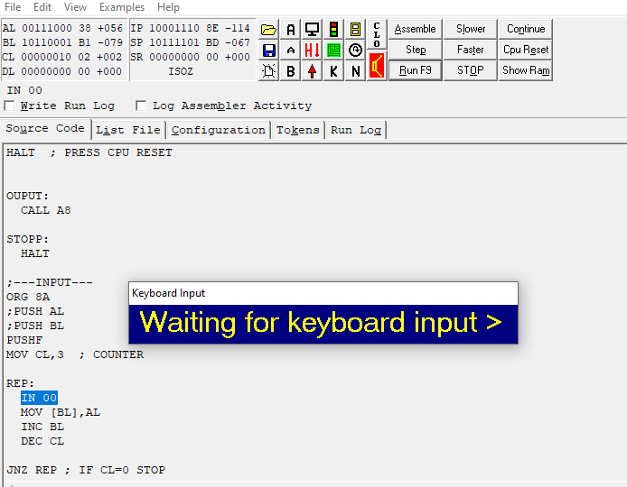
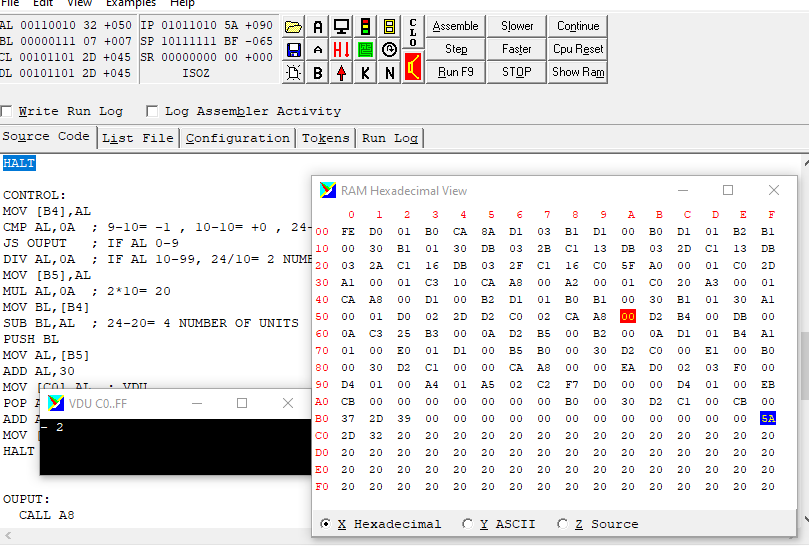
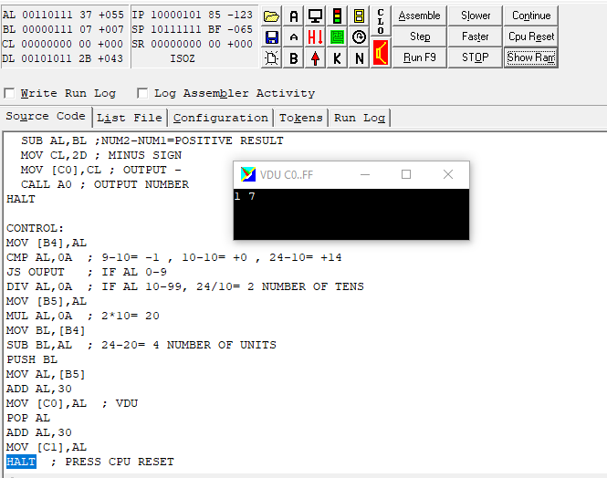
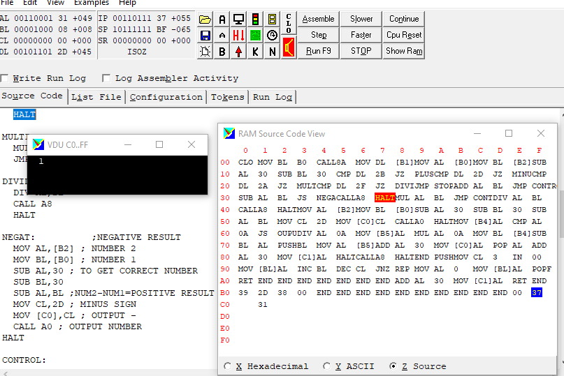
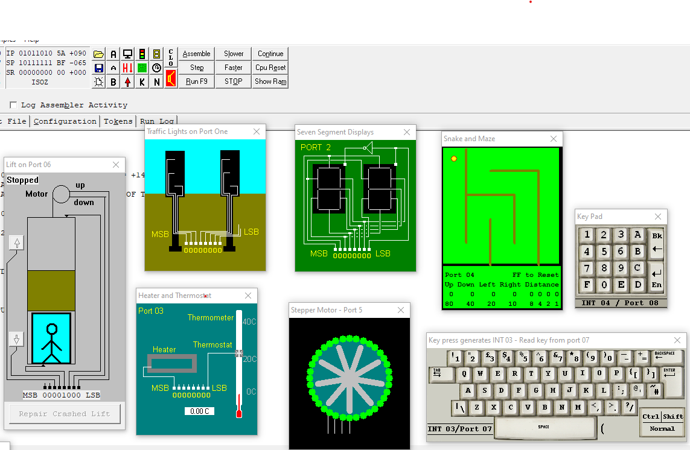

# Single digit calculator displaying results on a virtual screen and reads input from a physical keyboard.
### The program created using Assembly language in Microprocessor Simulator V5.0 for microprocessor.

### Microprocessor architecture
- Central processing unit (CPU)  
- 256 bytes of random access memory (RAM)  
- 16 input output (IO) ports. Only six are used.  
- A hardware timer that triggers interrupt 02 at regular time intervals that you can pre-set using the configuration tab.  
- A keyboard that triggers interrupt 03.  
- Peripherals connected to the Ports.

### General Purpose Registers.  
The CPU has four general-purpose registers called AL, BL, CL and DL. These are eight bits or one byte wide. Registers can hold unsigned numbers in the range 0 to +255 and signed numbers in the range –128 to +127. These are used as temporary storage locations. Registers are used in preference to RAM locations because it takes a relatively long time to transfer data between RAM and the CPU. Faster computers generally have more CPU registers or memory on the CPU chip.

The registers are named AL, BL, CL and DL because the 16-bit version of this CPU has more registers called AH, BH, CH and DH. The 'L' means Low and the 'H' means High. These are the low and high ends of the 16-bit register.

**The program raeds the keystroke and writes the character code to AL registers**

### Special Purpose Registers
The special purpose registers in the CPU are called IP, SR and SP.

### IP is the Instruction pointer.  
This register contains the address of the instruction being executed. When execution is complete, IP is increased to point to the next instruction. Jump instructions alter the value of IP so the program flow jumps to a new position. CALL and INT also change the value stored in IP. In the RAM displays, the instruction pointer is highlighted red with yellow text.

**To output a negative number, functions with checks were written using the Status Register.**

### SR is the Status Register.   
This register contains flags that report the CPU status.

The 'Z' zero flag is set to one if a calculation gave a zero result.   
The 'S' sign flag is set to one if a calculation gave a negative result.   
The 'O' overflow flag is set if a result was too big to fit in a register.   
The 'I' interrupt is set if interrupts are enabled. See CLI and STI.

### SP is the Stack Pointer   
The stack is an area of memory organised using the LIFO last in first out rule. The stack pointer points to the next free stack location. The simulator stack starts at address BF just below the RAM used for the video display. The stack grows towards address zero. Data is pushed onto the stack to save it for later use. Data is popped off the stack when needed. The stack pointer SP keeps track of where to push or pop data items. In the RAM displays, the stack pointer is highlighted blue with yellow text.

**Output of a number with two characters.**

### Random Access Memory
The simulator has 256 bytes of ram. The addresses are from 0 to 255 in decimal numbers or from [00] to [FF] in hexadecimal. RAM addresses are usually given in square brackets such as [7C] where 7C is a hexadecimal number. Read [7C] as "the data stored at location 7C".

### Viewing Machine Code
The machine code stored in RAM can be viewed in three modes by selecting the appropriate radio button.

- Hexadecimal - This display corresponds exactly to the binary executed by the CPU.

- ASCII - This display is convenient if your program is processing text. The text is readable but the machine codes are not.

- Source Code - This display shows how the assembly code commands are placed in memory.

### Busses
Busses are collections of wires used to carry signals around the computer. They are commonly printed as parallel tracks on circuit boards. Slots are sockets that enable cards to be connected to the system bus. An 8-bit computer typically has registers 8 bits wide and 8 wires in a bus. A 16-bit computer has 16 bit registers and 16 address and data wires and so on. The original IBM PC had 8 data wires and 20 address wires enabling one megabyte of RAM to be accessed. 32 bit registers and busses are now usual (1997-2003).

### Other Microprocessor Simulator V5.0  possibilities for programming.

